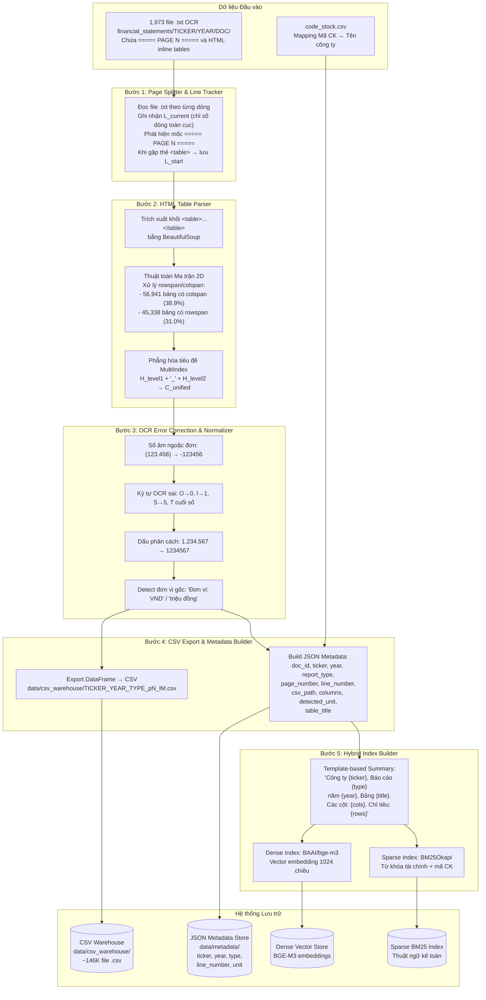

# Pipeline 1: OCR Text Processing, HTML Table Extraction & Hybrid Indexing

## Tổng quan

Pipeline 1 chuyển đổi **1,973 file OCR text (.txt)** chứa **146,246 bảng HTML inline** thành:
1. Kho CSV chuẩn hóa (`data/csv_warehouse/`)
2. Metadata JSON cho mỗi bảng (`data/metadata/`)
3. Chỉ mục lai Dense (BGE-M3) + Sparse (BM25) phục vụ Pipeline 2

## Sơ đồ luồng xử lý



## Chi tiết thuật toán Ma trận 2D (HTML Table Parser)

```python
# Pseudocode cho thuật toán dàn phẳng ô gộp
def parse_html_table(table_html: str) -> pd.DataFrame:
    soup = BeautifulSoup(table_html, 'html.parser')
    rows = soup.find_all('tr')
    
    # 1. Tính kích thước ma trận
    max_cols = max(sum(int(td.get('colspan', 1)) for td in row.find_all(['td','th'])) for row in rows)
    matrix = [[None] * max_cols for _ in range(len(rows))]
    
    # 2. Điền giá trị vào ma trận, xử lý rowspan/colspan
    for r, row in enumerate(rows):
        col_idx = 0
        for cell in row.find_all(['td', 'th']):
            while col_idx < max_cols and matrix[r][col_idx] is not None:
                col_idx += 1
            rspan = int(cell.get('rowspan', 1))
            cspan = int(cell.get('colspan', 1))
            value = cell.get_text(strip=True)
            for i in range(rspan):
                for j in range(cspan):
                    if r+i < len(matrix) and col_idx+j < max_cols:
                        matrix[r+i][col_idx+j] = value
            col_idx += cspan
    
    # 3. Tạo DataFrame từ ma trận
    return pd.DataFrame(matrix[1:], columns=matrix[0])
```

## Cấu trúc Metadata JSON cho mỗi bảng

```json
{
  "doc_id": "AAA_financial_statements_2015_consolidated",
  "ticker": "AAA",
  "year": 2015,
  "report_type": "consolidated",
  "page_number": 7,
  "line_number": 214,
  "csv_path": "data/csv_warehouse/AAA_2015_consolidated_p7_l214.csv",
  "columns": ["TÀI SẢN", "Mã số", "Thuyết minh", "31/12/2015", "01/01/2015"],
  "detected_unit": "VND",
  "table_title": "BẢNG CÂN ĐỐI KẾ TOÁN HỢP NHẤT",
  "num_rows": 32,
  "num_cols": 5,
  "statement_type": "CDKT"
}
```

## Thống kê Dataset thực tế

| Chỉ số | Giá trị |
|---|---|
| Tổng số file .txt | 1,973 |
| Tổng số bảng HTML | 146,246 |
| Bảng có colspan | 56,941 (38.9%) |
| Bảng có rowspan | 45,338 (31.0%) |
| Số công ty (tickers) | 100 |
| Giai đoạn | 2015–2025 |
| Dung lượng text thô | ~363 MiB |
