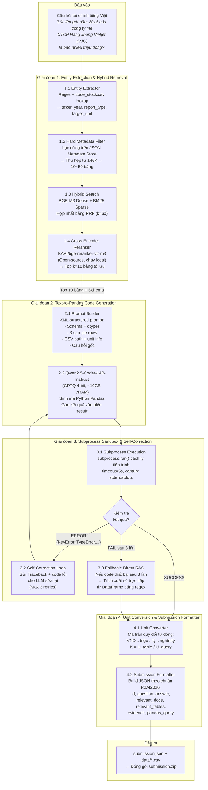

# Pipeline 2: Entity Extraction, Hybrid Retrieval, Text-to-Pandas & Execution

## Tổng quan

Pipeline 2 tiếp nhận câu hỏi tài chính tiếng Việt, tìm đúng bảng dữ liệu, sinh mã Pandas,
thực thi an toàn, và xuất kết quả theo chuẩn submission R2AI2026.

## Sơ đồ luồng xử lý



---

## Walkthrough chi tiết với câu hỏi mẫu

### CÂU HỎI MẪU (Input)

> _"Lãi tiền gửi năm 2018 của công ty mẹ CTCP Hàng không Vietjet (VJC) là bao nhiêu triệu đồng?"_

---

### GIAI ĐOẠN 1: Entity Extraction & Hybrid Retrieval

#### 1.1 Entity Extractor

- **Nhiệm vụ:** Phân tích câu hỏi, trích xuất thực thể bằng Regex + tra cứu `code_stock.csv`.
- **Đầu ra:**

```json
{
  "ticker": "VJC",
  "year": 2018,
  "report_type": "separate",
  "target_unit": "triệu đồng",
  "target_metric": "Lãi tiền gửi"
}
```

> **Lưu ý:** Từ khóa "công ty mẹ" → `report_type = "separate"` (BCTC riêng lẻ).
> Nếu không có "công ty mẹ" hoặc có "hợp nhất" → `report_type = "consolidated"`.

#### 1.2 Hard Metadata Filter

- **Nhiệm vụ:** Lọc cứng trên JSON Metadata Store theo `ticker=VJC`, `year=2018`, `report_type=separate`.
- **Đầu ra:** Thu hẹp từ ~146,246 bảng → còn ~20-50 bảng ứng viên.

#### 1.3 Hybrid Search + 1.4 Reranker

- **Nhiệm vụ:** Tìm kiếm lai trên tập ứng viên:
  - **Dense (BGE-M3):** Tìm theo ngữ nghĩa "Lãi tiền gửi" → match bảng Thuyết minh BCTC
  - **Sparse (BM25):** Match chính xác thuật ngữ "Lãi tiền gửi", "VJC"
  - **RRF Fusion:** Hợp nhất điểm Dense + Sparse
  - **Cross-Encoder Rerank:** `BAAI/bge-reranker-v2-m3` chọn top k=10
- **Đầu ra:** 10 bảng CSV có điểm tương quan cao nhất, kèm metadata.

---

### GIAI ĐOẠN 2: Text-to-Pandas Code Generation

#### 2.1 Prompt Builder

- **Nhiệm vụ:** Xây dựng prompt có cấu trúc XML cho LLM.
- **Prompt mẫu:**

```xml
<system>
Bạn là Chuyên gia Phân tích Dữ liệu Kế toán Việt Nam.
Chỉ trả về code Python nằm trong ```python ... ```.
Code phải gán kết quả cuối cùng vào biến `result` (float hoặc int).
Không làm tròn trung gian. Giữ nguyên độ chính xác cao nhất.
</system>

<context>
CSV Path: data/csv_warehouse/VJC_2018_separate_p25_l890.csv
Schema: Chi_Tieu(str), Ma_So(str), Thuyet_Minh(str), Nam_2018(str), Nam_2017(str)
Đơn vị gốc trong bảng: VND
Đơn vị câu hỏi yêu cầu: triệu đồng

Sample rows:
| Chi_Tieu | Ma_So | Thuyet_Minh | Nam_2018 | Nam_2017 |
|---|---|---|---|---|
| Lãi tiền gửi | ... | 25.1 | 850.234.567.000 | 620.111.222.000 |
| Lãi cho vay | ... | 25.2 | 12.345.678.000 | 9.876.543.000 |
</context>

<question>
Lãi tiền gửi năm 2018 của công ty mẹ CTCP Hàng không Vietjet (VJC) là bao nhiêu triệu đồng?
</question>
```

#### 2.2 Qwen2.5-Coder-14B sinh mã

```python
import pandas as pd

df = pd.read_csv('data/csv_warehouse/VJC_2018_separate_p25_l890.csv')

# Tìm dòng chứa "Lãi tiền gửi"
row = df[df['Chi_Tieu'].str.contains('Lãi tiền gửi', case=False, na=False)]

# Lấy giá trị năm 2018, chuyển đổi từ chuỗi sang số
val_str = row['Nam_2018'].values[0]
val = float(str(val_str).replace('.', '').replace(',', '.').replace('(', '-').rstrip(')'))

# Quy đổi từ VND sang triệu đồng
result = val / 1_000_000
print(result)
```

---

### GIAI ĐOẠN 3: Subprocess Sandbox & Self-Correction

#### 3.1 Subprocess Execution

```python
import subprocess, sys

def execute_pandas_code(code: str, timeout: int = 5) -> dict:
    with open("temp_exec.py", "w", encoding="utf-8") as f:
        f.write(code)
    try:
        proc = subprocess.run(
            [sys.executable, "temp_exec.py"],
            capture_output=True, text=True, timeout=timeout
        )
        if proc.returncode == 0:
            return {"status": "SUCCESS", "output": proc.stdout.strip()}
        else:
            return {"status": "ERROR", "traceback": proc.stderr.strip()}
    except subprocess.TimeoutExpired:
        return {"status": "TIMEOUT", "traceback": "Execution timed out."}
```

- **Kết quả:** `{"status": "SUCCESS", "output": "850234.567"}`

#### 3.2 Self-Correction Loop

Nếu code bị lỗi (ví dụ: `KeyError: 'Nam_2018'`):
1. Gửi traceback + code gốc cho LLM
2. LLM phân tích lỗi, sinh code mới
3. Lặp lại tối đa 3 lần

#### 3.3 Fallback: Direct RAG

Nếu code vẫn thất bại sau 3 lần:
- Tìm trực tiếp giá trị số trong DataFrame bằng regex/string matching
- Trả về giá trị gần đúng nhất

---

### GIAI ĐOẠN 4: Unit Conversion & Submission Formatter

#### 4.1 Unit Converter

| Đơn vị gốc (BCTC) | Đơn vị yêu cầu | Hệ số K |
|---|---|---|
| VND (đồng) | triệu đồng | × 10⁻⁶ |
| VND (đồng) | tỷ đồng | × 10⁻⁹ |
| triệu đồng | tỷ đồng | × 10⁻³ |
| triệu đồng | nghìn tỷ đồng | × 10⁻⁶ |
| nghìn đồng | triệu đồng | × 10⁻³ |

```
result_final = 850234.567  # đã quy đổi sang triệu đồng
```

#### 4.2 Submission Formatter

```json
{
  "id": 1,
  "question": "Lãi tiền gửi năm 2018 của công ty mẹ CTCP Hàng không Vietjet (VJC) là bao nhiêu triệu đồng?",
  "answer": 850234.567,
  "relevant_docs": ["VJC_financial_statements_2018_separate"],
  "relevant_tables": ["VJC_financial_statements_2018_separate|890"],
  "evidence": [
    {
      "variable": "df",
      "csv_path": "data/csv_warehouse/VJC_2018_separate_p25_l890.csv"
    }
  ],
  "pandas_query": "import pandas as pd\ndf = pd.read_csv('data/csv_warehouse/VJC_2018_separate_p25_l890.csv')\nrow = df[df['Chi_Tieu'].str.contains('Lãi tiền gửi', case=False, na=False)]\nval = float(str(row['Nam_2018'].values[0]).replace('.','').replace(',','.'))\nresult = val / 1_000_000\nprint(result)"
}
```

---

## Quy định mô hình & thư viện

| Thành phần | Lựa chọn | Lý do |
|---|---|---|
| **Code LLM** | Qwen2.5-Coder-14B-Instruct (GPTQ 4-bit) | Tối ưu sinh Pandas, ≤14B, ~10GB VRAM |
| **Embedding** | BAAI/bge-m3 | Đa ngôn ngữ, 1024-dim, hỗ trợ tiếng Việt |
| **Reranker** | BAAI/bge-reranker-v2-m3 | Open-source cross-encoder, chạy local |
| **Sparse Search** | BM25Okapi (rank_bm25) | Match chính xác mã CK, thuật ngữ kế toán |
| **HTML Parser** | BeautifulSoup4 | Xử lý colspan/rowspan, chịu được HTML lỗi |
| **Execution** | subprocess.run() | Nhẹ, không cần Docker, phù hợp batch offline |

> ⚠️ **Ràng buộc cuộc thi:** Chỉ dùng LLM open-source ≤14B, phát hành trước 01/06/2026.
> Không dùng GPT-4o, Gemini, Cohere Rerank, hoặc bất kỳ API closed-source nào.
